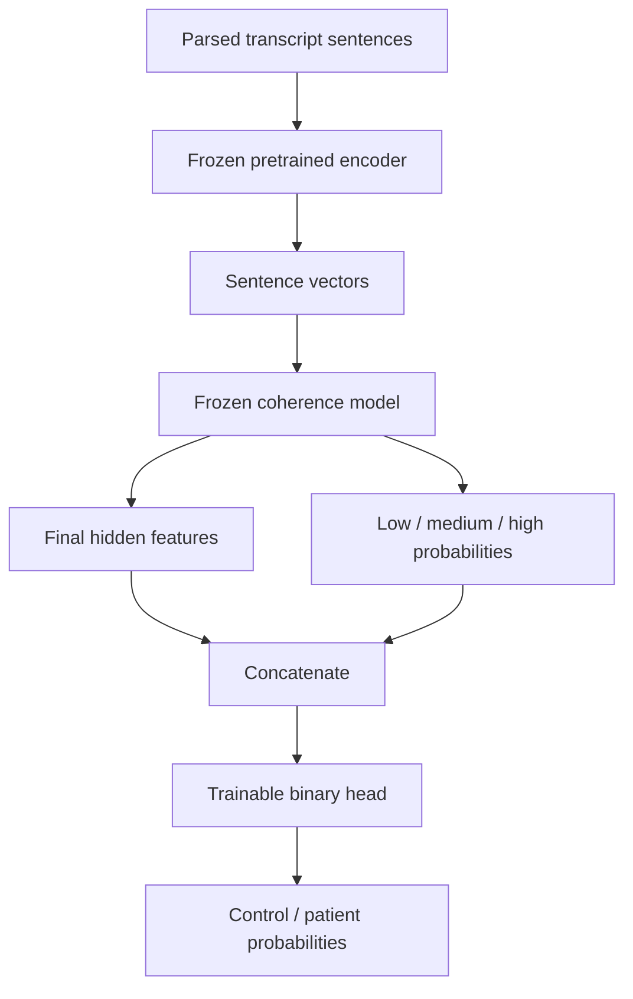

# Dementia classification using frozen coherence features

Research handoff for the professor (`hyejuj`)  
Prepared October 5, 2026

This report connects the available code, dataset, experimental procedures, and supplied aggregate results. The project investigates whether features from a coherence prediction model can support patient/control classification. The supplied binary confusion matrix gives **54.4% accuracy and 0.543 macro-F1** on 445 records. Performance varies substantially by topic, and the current split procedures allow participant overlap. These results support further investigation, but do not establish performance on unseen participants.

The evidence consists of the inspected project source, a parsed 2,222-record dataset, the supplied balanced-training script in Word, and the supplied results CSV. Numerical results were audited without retraining. The exact historical binary checkpoint, command, and prediction records were not provided, so the result-to-run mapping remains incomplete. [Section 7](#7-reproduction-and-handoff) explains what is executable and what remains unverified.

## 1. Research question and project scope

The implemented binary pipeline combines a pretrained coherence model's final hidden representation with its low/medium/high softmax probabilities, then trains a small head to predict control or patient. The working question is whether these coherence-derived features distinguish the groups across dialogue topics.

The supplied spreadsheet also reports connective statistics and two named coherence systems, RelCoh and EntRelCoh, under “10 Fold” and “1 Fold” headings. These are retained as reported experimental labels. The available binary training routes instantiate `SentTransformer` or `BaseClassifer`; neither selects `FusionClassifier`. The files inspected do not establish which implementation/checkpoint produced every RelCoh or EntRelCoh column. An EntRelCoh training entry point and checkpoint provenance still need to be supplied.

**Code connection:** [model.py](../model.py), [training script](../train_relcoh_binary_hyperparam_tuned.py), and the complete [code map](CODE_MAP.md).

## 2. Data and preprocessing

The current input is `data/dataset/dimentia/all_test_parsed_filtered_inference_ready.jsonl`. It contains **2,222 records**, **1,378 control records**, **844 patient records**, and **330 distinct `patient_id` values**. No duplicate record IDs, missing patient IDs, or empty sentence lists were found. Counts are records or tasks unless explicitly identified as participants.

| Topic | Records in current parsed input |
|---|---:|
| Cat | 328 |
| Cinderella | 330 |
| Cinderella_Intro | 326 |
| Cookie | 329 |
| Rockwell | 331 |
| Sandwich | 330 |
| Sandwich_Favorite | 124 |
| Tea | 124 |

Each record contains `id`, `patient_id`, `source_group`, `source_label`, `dialogue_topic`, `topic_index`, `source_file`, `sents`, `rels`, `spans`, and `score`. The binary preparation function derives control/patient labels from explicit group fields and replaces `score` for binary training. All original `score` values in this particular input are `low`; they must not be interpreted as verified human coherence annotations or used as ground truth for a coherence accuracy claim.

`SentDataset` tokenizes the joined sentences and uses a frozen pretrained encoder to create document, sentence, and argument vectors. Defaults limit input to 512 tokens, 24 sentences, and 32 arguments. It stores cached vectors near the input file. The cache key includes source size/modification time, encoder family, and length settings; it is not a complete model-and-input content fingerprint. Clear or isolate caches when switching model revisions or data configurations.

The optional parser identifies connectives, forms argument pairs, predicts explicit/implicit discourse relations, and writes sentence/relation/span fields. A fully verified raw-corpus acquisition, transcript conversion, and filtering workflow was not available. The original corpus citation, inclusion/exclusion criteria, and checkpoint source must be added before claiming complete raw-to-result reproduction.

**Code connection:** [dataset.py](../dataset.py) (`SentDataset`, `merge_sents`, `get_span_representation`); [parser](../pdtb/pdtb_parser_single_file_updated.py); [dataset audit](../scripts/audit_dataset.py); [aggregate dataset audit output](../results/audits/dataset_audit.json).

## 3. Model architecture

For the default sentence route, input vectors are projected to hidden size 256, receive absolute positional embeddings, pass through one eight-head transformer encoder and document pooling, and are reduced to a 64-dimensional final hidden vector. The original coherence classifier maps that vector to three coherence classes. Concatenating the hidden vector with three probabilities gives a 67-dimensional binary input. The new head uses dropout, a linear projection to 128 units, ReLU, dropout, and a linear projection to two classes. These dimensions assume the default settings and three coherence labels.

The pretrained text encoder and coherence model remain frozen. Coherence parameters have `requires_grad=False`, extraction occurs under `torch.no_grad()`, and the wrapper keeps the coherence model in evaluation mode even when the new head trains. The default binary label order is control=0, patient=1.

Both current training scripts define and instantiate `EnhancedFrozenCoherenceBinaryClassifier`, which supports class-weighted loss. They can both use the same root `model.py`. The imported `FrozenCoherenceBinaryClassifier` and its fallback are retained, but the enhanced wrapper is the active construction path. Historical `model_origin.py` and `model_v2.py` are archived for comparison; they are not imported by these experiments.

**Code connection:** [model.py](../model.py) (`SentTransformer.extract_features`, `BaseClassifer.extract_features`); [module.py](../module.py) (`Transformer_Encoder`, `Doc_Pooler`); `EnhancedFrozenCoherenceBinaryClassifier` and `build_frozen_binary_model` in each training script.

## 4. Experimental procedures

| Setting | Balanced topic-split script | Current hyperparameter-tuning script |
|---|---|---|
| Binary split | About 80% train / 20% test within each topic | With tuning enabled: fixed folds 1–8 train, 9 validation, 10 test |
| Stratification | Within-topic control/patient when feasible | Label plus topic if each stratum supports ten folds; otherwise label-only, then shuffled KFold |
| Loss | Balanced cross-entropy by default | Balanced cross-entropy by default in the current inspected version |
| Learning rate | One configured value | Five candidates by default: 0.00001, 0.00003, 0.0001, 0.0003, 0.001 |
| Selection | Validation macro-F1 by default if dev data are provided; otherwise latest epoch | Lowest validation loss across candidate rates and epochs |
| Retraining after selection | Not a search procedure | Copies the selected checkpoint; does not retrain on train plus validation |

The balanced script defaults to `binary_dev_ratio=0`, so validation is not automatic. The provided launch recipe deliberately sets 0.125 of the 80% training portion aside for validation, resulting in roughly 70/10/20. This prospective recipe is not asserted to be the historical run configuration.

Both current scripts compute class weights as `(N / (K * class_count)) ** power` from the actual training portion, with power 1 by default. Passing `--binary_loss_weighting none` disables weighting. An earlier version of the tuning script used unweighted loss; the current source already incorporates weighted loss. Result comparisons must name the exact revision and option.

The tuning procedure does not rotate validation/test folds across ten runs. The independent `--do_cv` route performs coherence-model cross-validation and optionally retrains the coherence model on full data. The CSV's “10 Fold” heading cannot by itself establish which of these procedures produced it.

Shared defaults include seed 106524, dropout 0.1, AdamW, weight decay 0.1, warmup ratio 0.06, and gradient clipping at 2.0. Model class definitions hard-code one transformer layer and eight heads; corresponding command-line options are not evidence that arbitrary values are honored.

**Code connection:** [balanced training](../train_relcoh_10fold_cv_dementia_binary_topic80_20_balanced.py); [tuning](../train_relcoh_binary_hyperparam_tuned.py) (`make_binary_8_1_1_tuning_files`, `train_binary_head_for_lr_tuning`, `run_10fold_cv_model_selection`); [portable launcher](../scripts/run_experiment.py).

## 5. Reported results and arithmetic checks

The original [results CSV](../results/reported/final_results.csv) is preserved unchanged. The following overall metrics are recomputed from its counts; no model was run to generate new predictions.

| True group | Predicted control | Predicted patient | Total |
|---|---:|---:|---:|
| Control | 129 | 145 | 274 |
| Patient | 58 | 113 | 171 |
| Total | 187 | 258 | 445 |

| Metric | Recomputed value |
|---|---:|
| Accuracy | 0.5438 |
| Macro-F1 | 0.5432 |
| Control recall | 0.4708 |
| Patient recall | 0.6608 |
| Always-control accuracy baseline | 0.6157 |

Accuracy is `(129 + 113) / 445`. Macro-F1 is the mean of the two class F1 scores, computed from the same matrix. The binary classifier has lower accuracy than the majority-class baseline, while recovering some patient cases that an always-control predictor misses. Accuracy alone is therefore insufficient to describe the tradeoff.

### 5.1 Topic-level binary performance

The following values are recomputed from the unique integer confusion matrices consistent with each topic's class totals, prediction totals, and rounded recalls. They are arithmetic reconstructions, not original per-record predictions.

| Topic | Records | Accuracy | Macro-F1 | Control recall | Patient recall |
|---|---:|---:|---:|---:|---:|
| Cat | 66 | 0.5303 | 0.5276 | 0.3750 | 0.7692 |
| Cinderella | 66 | 0.6970 | 0.6925 | 0.6750 | 0.7308 |
| Cinderella Intro | 65 | 0.3846 | 0.2778 | 0.0000 | 1.0000 |
| Cookie | 66 | 0.5000 | 0.4857 | 0.2750 | 0.8462 |
| Rockwell | 66 | 0.5152 | 0.5147 | 0.4000 | 0.6923 |
| Sandwich | 66 | 0.5455 | 0.4058 | 0.8500 | 0.0769 |
| Sandwich_Favorite | 25 | 0.7200 | 0.6881 | 0.7647 | 0.6250 |
| Tea | 25 | 0.6000 | 0.5040 | 0.7647 | 0.2500 |

The reconstructed topic matrices sum exactly to the overall confusion matrix. Tea's source macro-F1 is 0.765, but the counts imply approximately **0.504**. Cinderella's source macro-F1 (0.693) and Sandwich's source accuracy (0.546) also differ slightly from conventional rounding of the inferred values. Original cells remain preserved and discrepancies are recorded in [results_audit.json](../results/audits/results_audit.json).

Cinderella Intro predicts every record as patient, while Sandwich misses most patients. This strong topic dependence motivates investigation of transcript length, topic-specific distributions, and participant overlap before interpreting the pooled score.

### 5.2 Connective statistics

The CSV reports control/patient task counts, mean word counts, mean connective counts, and normalized connective statistics for eight topics. For example, Cinderella has mean word counts 495.81 versus 353.66 and mean connective counts 48.90 versus 34.85 for control versus patient. Its reported normalized values are 0.099 versus 0.101. Raw connective counts therefore should not be interpreted without length context. The precise normalization formula and aggregation procedure are not documented by the supplied table; a mean of per-record ratios is not generally the ratio of group means.

The connective table sums to **2,221 tasks**, whereas the current parsed input has 2,222 records. Topic aliases also vary (`Favorite_Sandwich`, `Sandwich_Favorite`, and `Cinderella Intro` versus `Cinderella_Intro`). These are reconciliation items, not evidence that all table blocks used identical inputs. The original connective-counting entry point was not identified among the supplied scripts; `cal_coef.py` computes relation n-gram statistics and correlations, not a verified reproduction of this table.

### 5.3 Coherence predictions

The CSV contains low/medium/high counts and proportions for RelCoh and EntRelCoh under two fold headings. Most reported mass is in low/high rather than medium, with topic-specific differences. For example, the “10 Fold” Cat high fractions are 0.075 control versus 0.055 patient for RelCoh, and 0.190 versus 0.531 for EntRelCoh. These are prediction distributions, not coherence accuracy measurements.

Counts differ across some blocks: the “10 Fold” RelCoh Cinderella_Intro patient row totals 125, while the connective table lists 126; the EntRelCoh Rockwell control row totals 204, while the connective table lists 202. The “1 Fold” EntRelCoh Favorite_Sandwich control row totals 87, while its connective task count is 86. These denominator differences require original row-level outputs and filtering logs to resolve. No significance test or system superiority claim is supported by the supplied aggregate table alone.

**Code connection:** [audit_results.py](../scripts/audit_results.py) verifies binary arithmetic; `predict_binary_only` and `print_binary_results_by_dialogue_topic` in both trainers export binary predictions and topic summaries. No verified code mapping is asserted for the missing historical EntRelCoh or connective-count runs.

## 6. Limitations and next experiments

**Participant overlap is confirmed for recreated default splits.** Using the current 2,222-record input and seed 106524, the topic split contains 1,777 training and 445 testing records and shares **144 participants** between training and testing. The fixed 8/1/1 split contains 1,778 training, 222 validation, and 222 testing records, sharing **168 participants** between training/validation, **170** between training/test, and **77** between validation/test. The audit uses `(source_group, patient_id)`; stable identity across visits still needs confirmation. These are recreated defaults, not verified membership lists from the historical CSV run.

The 445-record recreated topic test split has the same group/topic counts as the binary results table. This is consistent with that protocol but is insufficient to prove the exact historical split or checkpoint.

Before claiming unseen-participant performance, construct participant-disjoint folds and rerun evaluation. To compare class weighting or learning rates fairly, keep the participant-disjoint test set fixed and make selections only on validation data. Preserve historical results under their original protocol label.

Other reproducibility limitations are:

- The supplied CSV lacks the exact binary run ID, command, checkpoint, model revision, and per-record prediction files.
- Existing checkpoint loads use `strict=False`; inspect key compatibility before relying on alternative checkpoints.
- In weighted tuning, the evaluator averages per-batch weighted losses by batch size. That is not necessarily the same as a single globally weight-normalized cross-entropy. Preserve the historical criterion and define any corrected future criterion explicitly.
- The active dataset has a legacy argument-end truncation assignment using one value when there are more than `max_arg_num` relations. The sentence route ignores argument vectors at model input, but relation/fusion routes need a separate review before use.
- The current source does not establish the provenance and reproducibility of all spreadsheet experiment blocks. No missing methods, participant eligibility rules, or checkpoint citations are invented here.

**Code connection:** [default split audit](../scripts/audit_default_splits.py), [split audit output](../results/audits/split_audit.json), and [actual split checker](../scripts/audit_dataset.py).

## 7. Reproduction and handoff

The [reproduction guide](REPRODUCING.md) lists installation steps, required assets, portable commands, output locations, and verification limits. The [code map](CODE_MAP.md) links every Python file to this report. The [verification record](VERIFICATION.md) distinguishes static/source tests from full training verification.

The handoff adds the balanced script as real Python, preserves earlier model versions under `archive/`, provides the original results CSV and reproducible audits, adds portable run commands with manifests, and replaces training defaults pointing to a personal machine. It does not retrain or rewrite historical results.

The next evidence needed is the historical binary command/checkpoint/predictions, corpus and checkpoint citations, EntRelCoh implementation, and connective-count methodology. After those are linked, run a participant-disjoint experiment and report its result separately. `hyejuj`'s collaborator invitation was confirmed pending on October 5, 2026; acceptance remains with the recipient.
